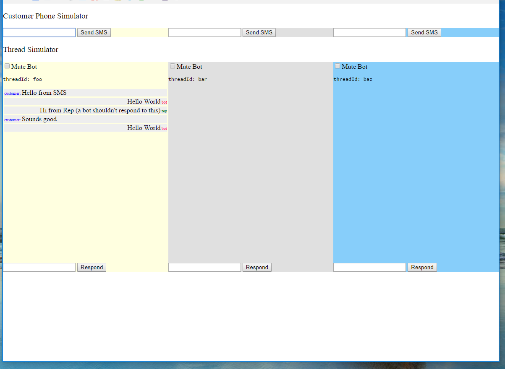

# Directline Test Client (for Instaply)
This is a test environment for developing the directline client for Instaply.  This test environment simulates the webhook and endpoint on Instaply's platform.

## Getting Started
1. `npm install`
1. Duplicate `.env.example` to `.env`
1. Change the endpoint environment variable to the live endpoint on azure (https://yourapp.azurewebsites.net/bot-receiver)
2. `npm start` to start the node app should be listening on 8090
2. start a ngrok tunnel `ngrok http 8090`, and note the https ngrok url
2. go to your azure web app and the App settings with: set `INSTAPLY_MESSAGE_POST_ENDPOINT` to `[YourHttpsNgrokEndpoint]/api/send-message-to-customer-thread` and set `INSTAPLY_MESSAGE_POST_TOKEN` to `abc`
3. go to the https ngrok url

## Screenshot

